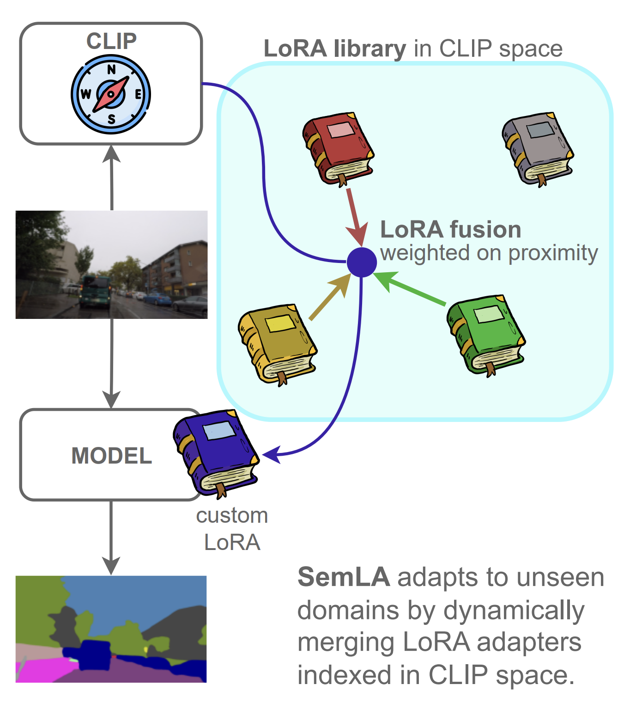

<h1 align="center">
  📕 Semantic Library Adaptation<br>
  <sub>LoRA Retrieval and Fusion for Open-Vocabulary Semantic Segmentation</sub><br>
</h1>

<p align="center" style="margin-top: -10px; font-size: 0.85em;">
  CVPR 2025
</p>

<br>

<p align="center">
  <strong>
    Reza Qorbani<sup>3 *</sup> &nbsp;&nbsp; 
    Gianluca Villani<sup>1,2 *</sup> &nbsp;&nbsp; 
    Theodoros Panagiotakopoulos<sup>1,5</sup><br> 
    Marc Botet Colomer<sup>1</sup> &nbsp;&nbsp;
    Linus Härenstam-Nielsen<sup>6,7</sup> &nbsp;&nbsp; 
    Mattia Segu<sup>1,9</sup> &nbsp;&nbsp; 
    Pier Luigi Dovesi<sup>1,4 †</sup><br>
    Jussi Karlgren<sup>1,4</sup> &nbsp;&nbsp; 
    Daniel Cremers<sup>6,7</sup> &nbsp;&nbsp; 
    Federico Tombari<sup>6,8</sup> &nbsp;&nbsp; 
    Matteo Poggi<sup>10</sup>
  </strong>
</p>

<p align="center">
  <sup>1</sup>The Good AI Lab &nbsp;&nbsp;
  <sup>2</sup>University of Toronto &nbsp;&nbsp;
  <sup>3</sup>KTH &nbsp;&nbsp;
  <sup>4</sup>AMD Silo AI<br>
  <sup>5</sup>King &nbsp;&nbsp;
  <sup>6</sup>Technical University of Munich &nbsp;&nbsp;
  <sup>7</sup>Munich Center for Machine Learning<br>
  <sup>8</sup>Google &nbsp;&nbsp;
  <sup>9</sup>ETH Zurich &nbsp;&nbsp;
  <sup>10</sup>University of Bologna
</p>

<p align="center">
  <sub>
    <sup>*</sup>Joint first authorship &nbsp;&nbsp;
    <sup>†</sup>Project Lead
  </sub>
</p>

<p align="center">
  <a href="https://arxiv.org/abs/2503.21780">
    
  </a>
  &nbsp;&nbsp;
  <a href="https://thegoodailab.org/blog/semla">
    
  </a>
</p>


This repository contains the official implementation of our paper "Semantic Library Adaptation: LoRA Retrieval and Fusion for Open-Vocabulary Semantic Segmentation" published in CVPR 2025.


Semantic Library Adaptation (SemLA) is a training-free, test-time domain adaptation framework that dynamically retrieves and merges the most relevant LoRA adapters from a library based on semantic similarity to the target domain. SemLA constructs tailored models for each input without additional training, offering scalability, explainability, and privacy preservation.

<p align="center">
  
</p>
<!-- *Figure: Overview of our Semantic Library Adaptation (SemLA) approach for open-vocabulary semantic segmentation.* -->

## Structure

The repository is structured as follows:
- [catseg/](./catseg/): Contains the implementation of the [CAT-Seg](https://github.com/cvlab-kaist/CAT-Seg) model that is used as the open-vocabulary semantic segmentation backbone. The model checkpoint, adapters and generated embeddings should be stored in this directory as well.
- [domain_orchestrator/](./domain_orchestrator/): Contains the implementation of the main experiments reported in our paper. These experiments are `Zero-shot`, `Oracle`, `Uniform Merge`, and `Semla` from the Table 1. in the paper.
- [experiments.py](./experiments.py): Script to run the experiments.

## Installation

Please install `[uv](https://docs.astral.sh/uv/getting-started/installation/)` and then run:

```bash
make sync
```

## Data preparation

Please follow the instructions in [catseg/datasets/README.md](catseg/datasets/README.md) for setting up the core datasets. For the additional datasets used in our experiments, follow the dataset-specific instructions available on their official websites:

- [ACDC](https://acdc.vision.ee.ethz.ch)
- [MUSES](https://muses.vision.ee.ethz.ch)
- [Cityscapes](https://www.cityscapes-dataset.com)
- [BDD](http://bair.berkeley.edu/blog/2018/05/30/bdd/)
- [Mapillary Vistas 1.2](https://www.mapillary.com/dataset/vistas)
- [ADE20K](https://ade20k.csail.mit.edu)
- [India Driving Dataset](https://bair.berkeley.edu/blog/2018/05/30/bdd/)
- [COCONut](https://xdeng7.github.io/coconut.github.io/)

> <strong>IMPORTANT</strong>: Please store all datasets in the directory specified by the environment variable `$DETECTRON2_DATASETS`. Please check the `domain_args` function in [domain_orchestrator/utils.py](domain_orchestrator/utils.py) for the expected directory name and structure for each dataset.

### [NYU Depth V2](https://cs.nyu.edu/~fergus/datasets/nyu_depth_v2.html)

We followed the same setup as in [TokenFusion](https://github.com/yikaiw/TokenFusion?tab=readme-ov-file#datasets) for the NYU Depth V2 dataset. The dataset should be downloaded from [here](https://drive.google.com/drive/folders/1mXmOXVsd5l9-gYHk92Wpn6AcKAbE0m3X?usp=sharing) and extracted to the directory `$DETECTRON2_DATASETS/nyudv2/`. Then copy the [`train.txt`](/misc/nyudv2_splits/train.txt) and [`test.txt`](/misc/nyudv2_splits/test.txt) from [`/misc/nyudv2_splits/`](/misc/nyudv2_splits/) to the same directory (`$DETECTRON2_DATASETS/nyudv2/`). The directory structure should look like this:

```bash
$DETECTRON2_DATASETS/nyudv2/
├── depth/
├── mask/
├── rgb/
├── train.txt
└── test.txt
```

### [PASCAL Context 59](https://cs.stanford.edu/~roozbeh/pascal-context/)

To setup PASCAL Context 59 dataset, please follow the instruction in [FC-CLIP](https://github.com/bytedance/fc-clip/blob/main/datasets/README.md#pascal-voc-pas-21pas-20) repository instead of the instructions in CAT-Seg [README](catseg/README.md). Once you have donwloaded the dataset and the annotations, and installed [Detail API](https://github.com/zhanghang1989/detail-api), please run the preparation [script](catseg/datasets/prepare_pascal_ctx_sem_seg.py) `prepare_pascal_ctx_sem_seg.py` in the `catseg/datasets/` folder.

## Models

### Backbone

We used CAT-Seg (L) as our primary backbone. Please follow the instructions [here](catseg/README.md) to download the checkpoint. Once downloaded, place the checkpoint in the directory `catseg/models/` and rename the checkpoint to `model_final.pth`. In other words, the relative path to the checkpoint should be:
<!-- - catseg/
    - models/
        - model_final.pth -->

```bash
catseg/
├── models/
│   └── model_final.pth
```

### Adapters

We provide trained LoRAs which can be downloaded from [here](https://huggingface.co/rezaqorbani/SemLA/resolve/main/loradb.zip). Please extract the folder containing the LoRAs to `catseg/loradb/`. This folder contains one sub-folder for each adapter such that, once properly set up, the relative path to the LoRA should be:

```bash
catseg/
├── loradb/
│   ├── a150/
│   ├── acdc-fog/
│   ├── acdc-night/
│   ├── acdc-rain/
│   ├── ...
```

> <strong>IMPORTANT</strong>: Please do not alter the names of these folders, otherwise the experiments will not work properly.

## Training and Evaluation of LoRAs

> <strong>IMPORTANT</strong>: Before training or evaluating new LoRAs, please change the current directory to `catseg/` by running `cd catseg/`. 

Please first read the instructions in the CAT-Seg [README](./catseg/README.md) to understand how to train and evaluate the CAT-Seg model. Fine-tuning the CAT-Seg model using LoRAs is very similar to the standard training process. 

### Training LoRAs
We provide a convenient script: `run_lora.sh` for training LoRA adapters. This script simplify the process of domain adaptation through parameter-efficient fine-tuning. 

```bash
sh run_lora.sh [CONFIG] [NUM_GPUS] [OUTPUT_DIR] [OPTS] MODEL.LORA.NAME [ADAPTER_NAME]
```

For example, to train a LoRA on the `acdc-rain` domain with default parameters, run the following command:

```bash
sh run_lora.sh configs/acdc/rain/lora-rain-acdc.yaml 1 output/acdc-rain/ MODEL.LORA.NAME acdc-rain
```

This command trains a LoRA adapter for the ACDC rain domain. It uses the settings in `configs/acdc/rain/lora-rain-acdc.yaml`. While the full model gets saved to `output/acdc-rain/`, you only need the small LoRA adapter that's automatically stored in `catseg/loradb/acdc-rain/`. The full model file can be deleted after training since only the adapter is needed for later use.

The LoRA-related hyperparamters, including to which modules LoRAs should be attached to, the rank and default LoRA storage path, can all be found in the [`catseg/cat_seg/config.py`](./catseg/cat_seg/config.py) file.

To change the default hyperaparamters, you can either change the values in the config files (e.g., `configs/acdc/rain/lora-rain-acdc.yaml` for model paramters or [`catseg/cat_seg/config.py`](./catseg/config.py) for LoRA-related hyperaparamters) or pass the parameters and their new values as arguments to the training script directly. For example, to change the rank of the LoRA and the number of iterations you can run the following command:

```bash
sh run_lora.sh configs/acdc/rain/lora-rain-acdc.yaml 1 output/acdc-rain/ MODEL.LORA.NAME acdc-rain MODEL.LORA.RANK 10 SOLVER.MAX_ITER 1000
```

### Evaluating LoRAs

Evaluation script has a similar format to the training script. We provide a convenient script: `eval_lora.sh` for evaluating LoRA adapters. This script simplifies the process of evaluating LoRA adapters.

```bash
sh eval_lora.sh [CONFIG] [NUM_GPUS] [OUTPUT_DIR] [OPTS] MODEL.LORA.NAME [ADAPTER_NAME]
```

To evaluate a LoRA on the `acdc-rain` domain, run the following command:

```bash
sh eval_lora.sh configs/acdc/rain/lora-rain-acdc.yaml 1 output/acdc-rain/ MODEL.LORA.NAME acdc-rain
```

This command will attach the saved LoRA to the model and evaluate it on the `acdc-rain` domain.

## Experiment Methods

The framework supports four different domain adaptation methods:

- **Zero-shot**: Evaluates a model trained on source domains directly on target domains without adaptation. Serves as a baseline.

- **Oracle**: Uses a single LoRA adapter specifically trained on the target domain. When testing on domain `x`, uses only the adapter trained on `x`.

- **Uniform Merge**: Combines source domain adapters with equal weights. Simple strategy requiring no target domain data for weight calculation.

- **SemLA**: Dynamically weights source domain adapters based on similarity to the target domain. Weights are calculated during inference for each image.


## Running Experiments

Experiments are executed using the `experiments.py` script.

### Preparing Configuration Files

Prior to running experiments, the following YAML configuration files must be prepared:

#### 1. Source Domains File

List of source domains (`source_domains.yaml`):

```yaml
- domain1
- domain2
- domain3
- ...
```

#### 2. Target Domains File

List of target domains used for evaluation (`target_domains.yaml`):

```yaml
- domain1
- domain2
- ...
```

##### Domain Naming Convention

In order to run the experiments, the domain names in the `source_domains.yaml` and `target_domains.yaml` files must adhere to the following naming convention:

| Domain Name | Description |
|-------------|-------------|
| muses-rain-day | MUSES dataset images of rainy conditions during daylight |
| muses-rain-night | MUSES dataset images of rainy conditions at night |
| muses-clear-day | MUSES dataset images of clear weather during daylight |
| muses-clear-night | MUSES dataset images of clear weather at night |
| muses-snow-day | MUSES dataset images of snowy conditions during daylight |
| muses-snow-night | MUSES dataset images of snowy conditions at night |
| muses-fog-day | MUSES dataset images of foggy conditions during daylight |
| muses-fog-night | MUSES dataset images of foggy conditions at night |
| acdc-rain | ACDC dataset images of rainy weather conditions |
| acdc-fog | ACDC dataset images of foggy weather conditions |
| acdc-night | ACDC dataset images captured at night |
| acdc-snow | ACDC dataset images of snowy weather conditions |
| cs-normal | Cityscapes dataset |
| bdd | BDD100K (10k subset) |
| mv | Mapillary Vistas|
| a150 | ADE20K dataset with 150 semantic classes |
| idd | India Driving Dataset |
| pc59 | PASCAL Context dataset with 59 semantic segmentation categories |
| nyu | NYU-Depth V2 dataset |
| coconutL | COCONUT-L dataset |

#### 3. Config File (required for SemLA)

Parameters for experiments (`semla_config.yaml`):
```yaml
distance_measure_name: euclidean  # or cosine
temperature: 0.05
top_k: 5
combination_type: cat
```

### Generating Average Embeddings

Before running the experiments, embeddings for each domain must be generated. This can be done by running the following command:

```bash
python domain_orchestrator/generate_embeddings.py --source_domains source_domains.yaml --lora_library_path catseg/loradb/ 
```

This script generates the average embedding for each domain specified in `source_domains.yaml` and saves them in the corresponding adapter folder `catseg/loradb/` directory. The embeddings are used to calculate the similarity between the source and target domains during adaptation. For example for the domain `acdc-rain`, after generating the embeddings, the directory structure for the domain acdc-rain should look like this:

<!-- - catseg/
    - loradb/
        - acdc-rain/
            - acdc-rain_statistics.npz
            - adapter_config.json
            - adapter_model.safetensors
        - ... -->

```bash
catseg/
├── loradb/
│   ├── acdc-rain/
│   │   ├── acdc-rain_statistics.npz
│   │   ├── adapter_config.json
│   │   └── adapter_model.safetensors
│   ├── ...
```

> <strong>NOTE</strong>: This step can take a while to complete, depending on the number of domains and the size of the dataset.
### Command Line Arguments

The following command line arguments are available for the `experiments.py` script:

- `--experiment`: Type of experiment (`zeroshot`, `oracle`, `uniform`, or `semla`)
- `--source_domains`: Path to YAML file containing source domains
- `--target_domains`: Path to YAML file containing target domains
- `--semla_config`: Path to YAML file containing configuration parameters (required for `semla` experiment)
- `--output_dir`: Directory to save results
- `--remove_target_adapter`: Flag to exclude the target domain's adapter from the source adapters during merging. This ensures a fair evaluation by preventing the model from using knowledge specific to the target domain.


### Output Files

The script saves the following output files in the specified output directory:

- `results.json`: Contains evaluation metrics (e.g., accuracy scores) for each target domain and experimental setting.

- `weights.json`: Contains the adapter weights used during the inference for each image when using the Online Merge (SEMLA) method.


## Example Commands

In all commands below, the argument `--source_domains` specifies which domains to load for and the argument `--target_domains` specifies which domains to evaluate on. For the `oracle`, the target domain is also used as a source domain (i.e., no adapatation is performed) and for `zeroshot`, no source domain is used for adaptation, but the the source domains should match the specified target domains.

### Zero-shot Benchmark

```bash
python experiments.py --experiment zeroshot \
    --source_domains config/source_domains.yaml \
    --target_domains config/target_domains.yaml \
    --output_dir ./results/zeroshot
```

### Oracle Benchmark

```bash
python experiments.py --experiment oracle \
    --source_domains config/source_domains.yaml \
    --target_domains config/target_domains.yaml \
    --output_dir ./results/oracle
```

### Uniform Merge Benchmark

```bash
python experiments.py --experiment uniform \
    --source_domains config/source_domains.yaml \
    --target_domains config/target_domains.yaml \
    --remove_target_adapter \
    --output_dir ./results/uniform
```

### SemLA Benchmark

```bash
python experiments.py --experiment semla \
    --semla_config config/semla_config.yaml \
    --source_domains config/source_domains.yaml \
    --target_domains config/target_domains.yaml \
    --remove_target_adapter \
    --output_dir ./results/semla
```

## License
 See [LICENSE](LICENSE) for details about the license terms for this repository. Portions of the project are under separate license terms. [CAT-Seg](https://github.com/cvlab-kaist/CAT-Seg) is licensed under the MIT License, and the license can be found [here](catseg/LICENSE). In addition, we use some files from [Detectron2](https://github.com/facebookresearch/detectron2) and [FC-Clip](https://github.com/bytedance/fc-clip) which are under the Apache-2.0 License and [Mask2Fromer](https://github.com/facebookresearch/Mask2Former) which is under the MIT License.

## Acknowledgements

We would like to thank the authors [CAT-Seg](https://github.com/cvlab-kaist/CAT-Seg) whose code has been utilized in this repository.

## Citation

If you find this repository useful in your research, please consider citing our paper:

```
@inproceedings{qorbani2025semla,
  author = {Qorbani, Reza and Villani, Gianluca and Panagiotakopoulos, Theodoros and Botet Colomer, Marc and H{\"a}renstam-Nielsen, Linus and Segu, Mattia and Dovesi, Pier Luigi and Karlgren, Jussi and Cremers, Daniel and Tombari, Federico and Poggi, Matteo},
  title = {Semantic Library Adaptation: LoRA Retrieval and Fusion for Open-Vocabulary Semantic Segmentation},
  booktitle = {Proceedings of the IEEE/CVF Conference on Computer Vision and Pattern Recognition (CVPR)},
  year = {2025}
}
```
